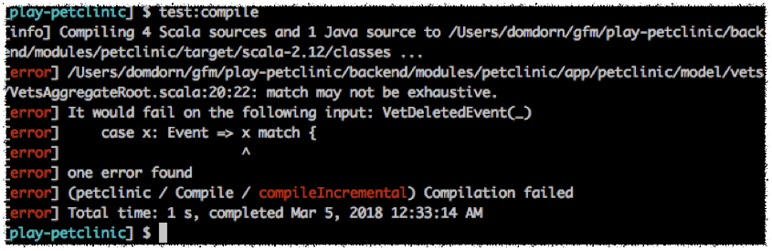

theme: Sketchnote
code: Fira Code Medium
text-strong: Roboto Bold, #EE783F
footer: **#Voxxed** Days Vienna 2018 **|** 12-13 March 2018 **|** Event Sourced µServices with Akka and Play! **|** Dominik Dorn
slidenumbers: true

[.slidenumbers: false]
[.hide-footer] 


---


# Event-Sourced µServices with Play! and Akka 
 by Dominik Dorn @ Voxxed Days Vienna 2018

--- 
[.hide-footer]

# Dominik Dorn

 * Freelance Software Engineer
 * Leader of 
  * Java-Vienna Meetup
  * PlayFramework.Wien Meetup
 * PlayFramework Integrator

**#Java**, **#Scala**, **#Akka**, **#Spark**
**#Play**, **#Cassandra**, **#Kafka**


---

# Overview
 * Intro to Event Sourcing
   * Events vs. Commands
   * The Journal, Command + Event-Handlers
 * (Short!) Intro to Actors
 * Actors in Akka

---

# Overview
 * Event-Sourcing with Akka-Persistence
   * Snapshots
   * Protocols + Compile-Time safety

---

# Overview
 * Intro to Command-Query-Responsibility-Segregation
 * Example: Aggregating Data
   * Ask everyone!
   * Using Akka-Persistence-Query
     * Attaching a Tag
   * Read-Sides w/ SQL
   * Minimizing delay

---
# Overview
 * Clustering with Akka
 * Code-Base structuring
 * Your Dev-Environment

---
# Intro to Event-Sourcing

 * Commands
 * Events
 * The Journal
 * Command-Handler
 * Event-Handler

--- 
# Commands & Events

 * Commands - Something the users wants us to do

```scala
case class RegisterUser(email: String, name: String)
case class ChangeName(email: String, newName: String)
```
 
 * Events - Something that happened in the __past__ 

```scala
case class UserRegistered(email: String, name: String)
case class NameChanged(newName: String)
```

---

# The (Event-)Journal

* Single Source of Truth
* Stores the Events

---
[.autoscale: false]
# The (Event-)Journal

looks like this

Entity-ID  |  Seq#  | Type |   Payload (e.g. in JSON)  |
-----| ----: | -----------: | ---:
user-1   |  1     | UserRegistered | `{email:"dominik.dorn@gmail.com", name:"Dominikk Dorn"}`
user-1   |  2     | NameChanged | `{newName:"Dominik Dorn"}`
user-2   |  1     | UserRegistered | `{email:"dominik@dominikdorn.com", name:"Dominik Dorn"}`

---

# Command-Handler

 * Enforces constraints

```scala
var registeredEmails: Vector[String] = Vector.empty
def receiveCommand = {
 case RegisterUser(email, name) => 
   if(registeredEmails.exists(_ == email)) {
      throw new UserAlreadyExistsException();
   } else {
     // registering..
   }
}
```

---

# Command-Handler

 * Persists to the Journal, before executing

```scala
 case RegisterUser(email, name) => 
  if(!registeredEmails.exists(_ == email)) {
    persistToJournal(UserRegistered(email, name)){ ev => 
      sendWelcomeMail(email, name)
    }
  }
```

---

# Command-Handler

 * (Can) Delegate to the event-handler(s)

```scala
 case RegisterUser(email, name) => 
    ...
    persistToJournal(UserRegistered(email, name)){ ev => 
      sendWelcomeMail(email, name)
      eventHandlers.foreach(handler => handler.receiveEvent(ev))
    }
  
```

---

# Event-Handlers

 * Work on Events from the past

```scala
var registeredEmails: Vector[String] = Vector.empty
def receiveEvent = {
 case UserRegistered(email, name) => 
    registeredEmails = registeredEmails :+ email 
}
```

---
# (Short!) Intro to Actors (in Akka)

|Actors | Humans|
|-------|-------|
| have state (fields, lists, etc.) | have properties (height, weight, knowledge) |
| communicate via messages | communicate via voice, sms, letters, looks, touch, ... |
| live in an ActorSystem   | live on Planet Earth |

--- 
## Getting information

about the current state of the soccer game

|Actors | Humans|
|-------|-------|
| gameActor.tell(GetCurrentScore) | shout("Hey Steve, what's the score?") |
| sender().tell(Score(3,2)) | shout("Its 3 to 2 for Manchester!") |
--- 
## Creation

|Actors | Humans|
|-------|-------|
| actorSystem.actorOf(Props(new Female("Adam"))) | god.create(Female("Eve")) |
| `context.childOf(Props(new Male())` | eve.forkWith(Adam) |

--- 
# Actors in Akka

```scala
class Human extends akka.actor.Actor {
    var name = ""
    override def receive = {
      case GiveName(name: String) =>  
        name = name; 
        sender() ! Hi(s"I'm $name")
    }
}
val adam: ActorRef = actorSystem.actorOf(Props(new Human())) 
adam ! GiveName("Adam")
```

---
# Persistent-Actors

```scala
class User(id: String, @Named("email") email: ActorRef) extends PersistentActor {
    // entity-id in the journal
    val persistenceId: String = s"user-$id"
    
    def receiveCommand = { ... } // handle commands
    def receiveRecover = { ... } // handle events
}
```

---

# Command-Handler

```scala
def receiveCommand = {
  case RegisterUser(email, name) => 
    // email constraints already checked before
    persist(UserRegistered(email, name)) { ev => 
//     ^--- persist stores into the journal
      receiveRecover.apply(ev)
//      ^--- apply the event to the event handler      
      email ! EmailProtocol.SendWelcomeMail(email, name)
      sender() ! akka.Done // tell that we're done
    }
}
```
---

# Command-Handler

```scala
def receiveCommand = {  
  ...
  case ChangeName(email, name) => 
    if(name != this.name) {
        persist(NameChanged(email, name)) { ev => 
          receiveRecover.apply(ev)
        }
    }
    sender() ! akka.Done // the new name is set
}
```

---

# Event-Handler

```scala
var email = ""
var name = ""
def receiveRecover = {
  case UserRegistered(email, name) => 
      this.email = email
      this.name = name
  case NameChanged(email, newName) => 
      this.name = newName
}
```

---

# Many events? Take Snapshots!

```scala

var lastSequenceNr = 0 // gets updated in event handler
def maybeMakeSnapshot() = if(lastSequenceNr % 1000 == 0) { 
  saveSnapshot((email, name))
}

def receiveCommand = {  
  ...
        persist(NameChanged(email, name)) { ev => 
          receiveRecover.apply(ev)
          maybeMakeSnapshot()
        }
}
```

---

# And Recover from it!

```scala
def receiveRecover = {
    case UserRegistered(email, name) =>   ... 
    case NameChanged(email, newName) =>   ...
    case SnapshotOffer(metaData, snapshot: (String, String)) =>
      this.email = snapshot._1
      this.name = snapshot._2 
}

```
---

# Best Practices: Protocols

```scala
object User { 
  object Events {
    sealed trait Event
    ...
  }
  object Commands {
      sealed trait Command
    ...
  }
  object Queries {
    sealed trait Query
    ...
  }
```

---


# Best Practices: Protocols - Events

```scala

object User {
  object Events {
    sealed trait Event
    case class UserCreatedEvent(email: String, name: String) extends Event
    case class NameChangedEvent(newName: String) extends Event
    case class FriendAddedEvent(friendEmail: String) extends Event
  }
    ...
```
---

# gives you: IDE support!


---

# gives you: Compile-time safety!



---
# Best Practices: Protocols - Commands

```scala
object User {   ...
  object Commands {
    sealed trait Command
    case class CreateUserCommand(email: String, name: String) extends Command
    sealed trait CreateUserResponse
    case class UserCreatedResponse(email: String) extends CreateUserResponse
    case object UserCreationFailedResponse extends CreateUserResponse
    
    case class ChangeNameCommand(email: String, name: String) extends Command
    sealed trait ChangeNameResponse
    case object NamedChangeResponse extends ChangeNameResponse
  }
```
---
[.slidenumbers: false]

[.hide-footer]

# Best Practices: Protocols - Queries

```scala
object User {   ... 
  object Queries {
    sealed trait Query
    
    sealed trait GetUserDetailsResponse
    case class GetUserDetails(email: String) extends Query
    case class UserDetails(email: String, name: String) 
      extends GetUserDetailsResponse
      
    sealed trait GetFriendsResponse
    case class GetFriends(email: String) extends Query
    case class Friends(friends: Seq[String]) extends GetFriendsResponse
    
    case object UserNotFound extends GetUserDetailsResponse with GetFriendsResponse
```

---

# Command Query Responsibility Segregation (CQRS)

* Split Actions (Commands) and Questions (Queries)
* Divide the code-base according to these
* Create optimized datastores (read-sides) for the various queries

---

# CQRS: Example: Get the names of all Users

different approaches

* The (naive) Actor way: Ask everyone!
* Read the Event-Log
* Create custom read-sides 

--- 

# Ask! Everyone

```scala
class GetAllNamesActor( ids: Vector[String], aggregate: ActorRef, 
        answerTo: ActorRef) extends Actor {
  var repliesWaiting: Vector[String] = ids
  var data: Map[String, String] = Map.empty
  ids.foreach(id => aggregate ! GetUserData(id))
  def receive = {
    case UserData(id, name) => 
      repliesWaiting = repliesWaiting.filterNot(_ == id)
      data = data.updated(id, name)
      if(repliesWaiting.isEmpty){
        answerTo ! GetAllNamesResponse(data.values)
      }
  }
}
```
---

# Using Akka-Persistence-Query

```scala
class GetAllNamesActor(...,answerTo: ActorRef,...) {  
  
  val readJournal = PersistenceQuery(context.system)
   .readJournalFor[CassandraReadJournal](CassandraReadJournal.Identifier)
  
  val importFuture: Future[Done] = startInitialImport(self).map(_ => Done)
  pipe(importFuture).to(self)

}
```

---
## Receive Events via Akka-Streams

```scala
  val ALL_CURRENT_IDS = readJournal.currentPersistenceIds()
  val ALL_IDS_IN_FUTURE = readJournal.persistenceIds()
  val FILTER_USERS = Flow[String].filter(s => s.startsWith("user-"))

  def startInitialImport(recipient: ActorRef) = 
    ALL_CURRENT_IDS.via(FILTER_USERS) // get all user persistence-ids
    .flatMapConcat(id => readJournal
   /*  ^ */  .currentEventsByPersistenceId(id, 0, Integer.MAX_VALUE))
   //  |--- join with all the events of these users    
    .runForeach(ev => recipient ! ev) 
    // ^ send all the events to recipient / ourself

```

----

## Process the events in the actor

```scala
class GetAllNamesActor(...,answerTo: ActorRef,...) {  
  ...
  def receive = {
    case Done => answerTo ! GetAllNamesResponse(data.values)
    case EventEnvelope(_, _, _, ev) => ev match {
        case UserRegistered(email, name) =>   ... // fill state
        case NameChanged(email, newName) =>   ... // fill state
    }
  }
}
```

---

 * Example: Aggregating Data
   * Ask everyone!
   * Using Akka-Persistence-Query
     * Attaching a Tag
   * Read-Sides w/ SQL
   * Minimizing delay

---
# Overview
 * Clustering with Akka
 * Code-Base structuring
 * Your Dev-Environment


### Hello World!

```scala
def myFunc() {
  System.out.println("das ist ein Test")
}


```
