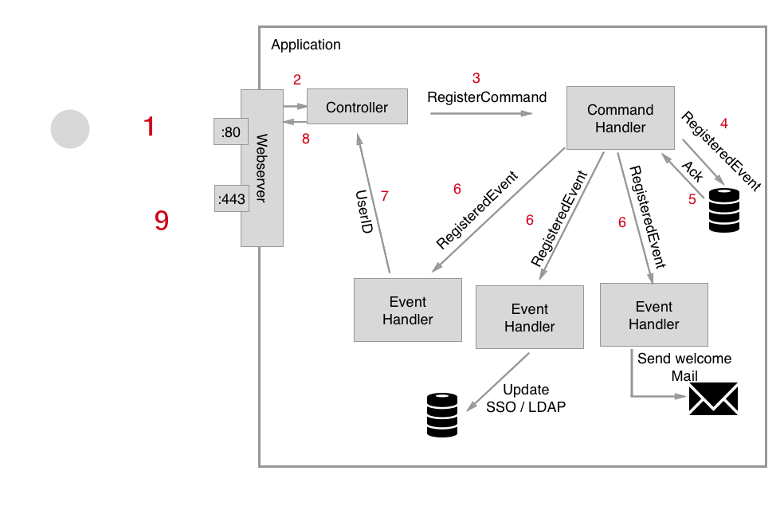
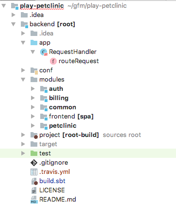
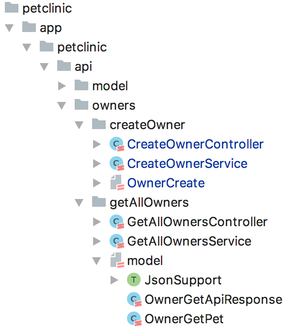
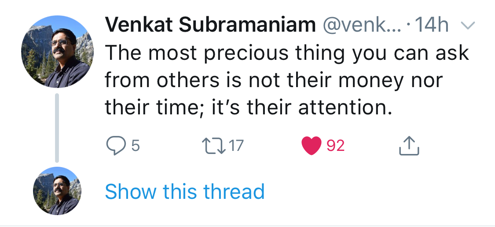

theme: Sketchnote
code: Fira Code Medium
text-strong: Roboto, #EE783F
footer: **#Voxxed** Days Vienna 2018 **|** 12-13 March 2018 **|** Event Sourced µServices with Akka and Play! **|** Dominik Dorn **@domdorn**
slidenumbers: true

[.slidenumbers: false]
[.hide-footer] 


---


# Event-Sourced µServices with Play! and Akka 
 by Dominik Dorn @ Voxxed Days Vienna 2018

--- 
[.hide-footer]

# Dominik Dorn

 * Freelance Software Engineer
 * Leader of 
  * Java-Vienna Meetup
  * PlayFramework.Wien Meetup
 * PlayFramework Integrator

**#Java**, **#Scala**, **#Akka**, **#Spark**
**#Play**, **#Cassandra**, **#Kafka**,**#Postgres** 


---

# Overview
 * Intro to Event Sourcing
 * (Short!) Intro to Actors + Actors in Akka
 * Event-Sourcing with Akka-Persistence
 * Intro to CQRS
 * Clustering with Akka
 * Code-Base/Dev-Env structuring + tips

---
# Intro to Event-Sourcing
 * Reasons + Example
 * Overview
 * Commands + Events
 * The Journal
 * Command-Handler + Event-Handler

--- 

# Reasons for Event Sourcing

 * High Performance
   * Immutable-Events
   * Append-Only Journal
   * Increased write-performance
 * No Object-Relation-Mapping needed
 * Full-Audit trail (GDPR / DSGVO anyone?)

---

# Examples of Event-Sourcing
 * Your Bank-/Paypal-Account
 * Git
 * Order Tracking (Post, DPD, UPS, etc.)
 * kind of: Blockchain .. BitCoin anyone? 
 
---
[.slidenumbers: false]

[.hide-footer]



--- 
# Commands & Events

 * Commands - Something **the users wants us to do**

```scala
case class RegisterUser(email: String, name: String)
case class ChangeName(email: String, newName: String)
```
 
 * Events - Something that happened in the __past__ 

```scala
case class UserRegistered(email: String, name: String)
case class NameChanged(newName: String)
```

---

# The (Event-)Journal

* Single Source of Truth
* Stores the Events
* Groups Events by Entity-ID
* Sequence-Number for every Entity-ID

---
# The (Event-)Journal

looks like this

|`Entity-ID  Seq#  Type`           | `Payload (e.g. in JSON)` 
|----------------------------------|:------------------:|
|`user-1       1  UserRegistered  `| `{email:"dominik.dorn@gmail.com", name:"Dominikk Dorn"}`
|`user-1       2  NameChanged     `| `{newName:"Dominik Dorn"}`
|`user-2       3  UserRegistered  `| `{email:"dominik@dominikdorn.com", name:"Dominik Dorn"}`

---

# Command-Handler

 * Enforces constraints

```scala
var registeredEmails: Vector[String] = Vector.empty
def receiveCommand = {
 case RegisterUser(email, name) => 
   if(registeredEmails.exists(_ == email)) {
      throw new UserAlreadyExistsException();
   } else {
     // registering..
   }
}
```

---

# Command-Handler

 * Persists to the Journal, before executing

```scala
 case RegisterUser(email, name) => 
  if(!registeredEmails.exists(_ == email)) {
    persistToJournal(UserRegistered(email, name)){ ev => 
      sendWelcomeMail(email, name)
    }
  }
```

---

# Command-Handler

 * (Can) Delegate to the event-handler(s)

```scala
 case RegisterUser(email, name) => 
    ...
    persistToJournal(UserRegistered(email, name)){ ev => 
      sendWelcomeMail(email, name)
      eventHandlers.foreach(handler => handler.receiveEvent(ev))
    }
  
```

---

# Event-Handlers

 * Work on Events from the past

```scala
var registeredEmails: Vector[String] = Vector.empty
def receiveEvent = {
 case UserRegistered(email, name) => 
    registeredEmails = registeredEmails :+ email 
}
```

---
# (Short!) Intro to Actors (in Akka)

|Actors | Humans|
|-------|-------|
| have state (fields, lists, etc.) | have properties (height, weight, knowledge) |
| communicate via messages | communicate via voice, sms, letters, looks, touch, ... |
| live in an ActorSystem   | live on Planet Earth |

--- 
## Creation

|Actors | Humans|
|-------|-------|
| system = new ActorSystem() | god.create(Planet("Earth"))
| system.actorOf(Props(new Female("Eve"))) | god.create(Female("Eve")) |
| `context.childOf(Props(new Male())` | eve.fork() // +adam |

--- 

## Getting information

about the current state of the soccer game

|Actors | Humans|
|-------|-------|
| gameActor.tell(GetCurrentScore) | shout("Hey Steve, what's the score?") |
| sender().tell(Score(3,2)) | shout("Its 3 to 2 for Manchester!") |
--- 
# Actors in Akka

```scala
class Human extends akka.actor.Actor {
    var name = ""
    override def receive = {
      case GiveName(name: String) =>  
        name = name; 
        sender() ! Hi(s"I'm $name")
    }
}
val adam: ActorRef = actorSystem.actorOf(Props(new Human())) 
adam ! GiveName("Adam")
```

---
# Persistent-Actors

```scala
class User(id: String, @Named("email") email: ActorRef)
  extends PersistentActor {
    // entity-id in the journal
    val persistenceId: String = s"user-$id"
    
    def receiveCommand = { ... } // handle commands
    def receiveRecover = { ... } // handle events
}
```

---

# Command-Handler

```scala
def receiveCommand = {
  case RegisterUser(email, name) => 
    // email constraints already checked before
    persist(UserRegistered(email, name)) { ev => 
//     ^--- persist stores into the journal
      receiveRecover.apply(ev)
//      ^--- apply the event to the event handler      
      email ! Email.Commands.SendWelcomeMail(email, name)
       // tell that we're done
      sender() ! UserRegisteredAnswer(email, name)
    }
}
```
---

# Command-Handler

```scala
def receiveCommand = {  
  ...
  case ChangeName(email, name) => 
    if(name != this.name) {
        persist(NameChanged(email, name)) { ev => 
          receiveRecover.apply(ev)
        }
    }
    sender() ! akka.Done // the new name is set
}
```

---

# Event-Handler

```scala
var email = ""
var name = ""
def receiveRecover = {
  case UserRegistered(email, name) => 
      this.email = email
      this.name = name
  case NameChanged(email, newName) => 
      this.name = newName
}
```

---

# Many events? Take Snapshots!

```scala

var lastSequenceNr = 0 // gets updated in event handler
def maybeMakeSnapshot() = if(lastSequenceNr % 1000 == 0) { 
  saveSnapshot((email, name))
}

def receiveCommand = {  
  ...
        persist(NameChanged(email, name)) { ev => 
          receiveRecover.apply(ev)
          maybeMakeSnapshot()
        }
}
```

---

# And Recover from it!

```scala
def receiveRecover = {
    case UserRegistered(email, name) =>   ... 
    case NameChanged(email, newName) =>   ...
    case SnapshotOffer(metaData, snapshot: (String, String)) =>
      this.email = snapshot._1
      this.name = snapshot._2 
}

```

--- 
# Keep memory low, set a ReceiveTimeout

```scala
class SomeActor extends Actor {
  context.setReceiveTimeout(3 seconds)
  def receive = {
   // ....
   case ReceiveTimeout => context.stop(self)
  }
}
```

---

# Best Practices: Protocols

```scala
object User { 
  object Events {
    sealed trait Event
    ...
  }
  object Commands {
      sealed trait Command
    ...
  }
  object Queries {
    sealed trait Query
    ...
  }
```

---


# Best Practices: Protocols - Events

```scala

object User {
  object Events {
    sealed trait Event
    case class UserCreatedEvent(email: String, name: String) extends Event
    case class NameChangedEvent(newName: String) extends Event
    case class FriendAddedEvent(friendEmail: String) extends Event
  }
    ...
```
---

# gives you: IDE support!


---

# gives you: Compile-time safety!


---
# Protocols: Commands + Responses

```scala
object User {   ...
  object Commands {
    sealed trait Command
    case class CreateUserCommand(email: String, name: String) extends Command
  
    sealed trait CreateUserResponse
    case class UserCreatedResponse(email: String) extends CreateUserResponse
    case object UserCreationFailedResponse extends CreateUserResponse
  }
```
---
[.slidenumbers: false]

[.hide-footer]

# Protocols: Queries + Responses

```scala
object User {   ... 
  object Queries {
    sealed trait Query
    
    sealed trait GetUserDetailsResponse
    case class GetUserDetails(email: String) extends Query
    case class UserDetails(email: String, name: String) 
      extends GetUserDetailsResponse
      
    sealed trait GetFriendsResponse
    case class GetFriends(email: String) extends Query
    case class Friends(friends: Seq[String]) extends GetFriendsResponse
    
    case object UserNotFound extends GetUserDetailsResponse with GetFriendsResponse
```

---
[.autoscale: false]
# Command Query Responsibility Segregation (CQRS)

* Split Actions (Commands) and Questions (Queries)
* Divide the code-base according to these separations
* Create optimized datastores (read-sides) for the various queries
* If necessary, create+scale read- + write-µServices

---

# CQRS: Example: Get the names of all Users

different approaches

* The (naive) Actor way: Ask everyone!
* Read the Event-Log
* Create custom read-sides 

--- 

# Ask! Everyone

```scala
class GetAllNamesActor( ids: Vector[String], aggregate: ActorRef, 
        answerTo: ActorRef) extends Actor {
  var repliesWaiting: Vector[String] = ids
  var data: Map[String, String] = Map.empty
  ids.foreach(id => aggregate ! GetUserData(id))
  def receive = {
    case UserData(id, name) => 
      repliesWaiting = repliesWaiting.filterNot(_ == id)
      data = data.updated(id, name)
      if(repliesWaiting.isEmpty){
        answerTo ! GetAllNamesResponse(data.values)
      }
  }
}
```
---

# Using Akka-Persistence-Query

```scala
class GetAllNamesActor(...,answerTo: ActorRef,...) {  
  
  val readJournal = PersistenceQuery(context.system)
   .readJournalFor[CassandraReadJournal](CassandraReadJournal.Identifier)
  
  val importFuture: Future[Done] = startInitialImport(self).map(_ => Done)
  pipe(importFuture).to(self)

}
```

---
## Receive Events via Akka-Streams

```scala
  val ALL_CURRENT_IDS = readJournal.currentPersistenceIds()
  val ALL_IDS_IN_FUTURE = readJournal.persistenceIds()
  val FILTER_USERS = Flow[String].filter(s => s.startsWith("user-"))

  def startInitialImport(recipient: ActorRef) = 
    ALL_CURRENT_IDS.via(FILTER_USERS) // get all user persistence-ids
    .flatMapConcat(id => readJournal
   /*  ^ */  .currentEventsByPersistenceId(id, 0, Integer.MAX_VALUE))
   //  |--- join with all the events of these users    
    .runForeach(ev => recipient ! ev) 
    // ^ send all the events to recipient / ourself

```

----

## Process the events in the actor

```scala
class InMemoryGetAllNamesActor(...,answerTo: ActorRef,...) {  
  ...
  def receive = {
    case Done => answerTo ! GetAllNamesResponse(data.values)
    case EventEnvelope(_, _, _, ev) => ev match {
        case UserRegistered(email, name) =>   ... // fill state
        case NameChanged(email, newName) =>   ... // fill state
    }
  }
}
```

----

## Create a SQL read-side

```scala
class UserSQLReadSideEventHandler() extends Actor {  
  // ... like in GetAllNamesActor with Akka-Streams
  def receive = {
    case EventEnvelope(_, _, _, ev) => ev match {
      case UserRegistered(email, name) =>  
        SQL(s"INSERT INTO users VALUES (...)")
      case NameChanged(email, newName) =>  
        SQL(s"UPDATE users SET name = ${newName} where email = ${email}")
    }
  }
}
```

---

## Akka-Streams Performance/low latency Optimizations

* Tag your Events using a WriteEventAdapter, then read with readJournal.eventsByTag()
* Publish Events in the CommandHandler to the Event-Stream, subscribe in the EventHandler(s)

---

# Clustering with Akka

* Use the akka-cluster module
* Use cluster sharding to place aggregates on nodes
* Don't distribute the contents of aggregates!
* Use cluster singletons for Read-Side Event-Handlers
* \#Shardregions: ~ 10 x #cluster-nodes

---
# Clustering with Akka

```scala
val userRegion: ActorRef = ClusterSharding(system).start (
  typeName = "User",
  entityProps = Props[User],
  settings = ClusterShardingSettings(system),
  // method how to extract the entity id of a message
  extractEntityId = extractEntityId,
  // how to derive the correct shard of a entity 
  extractShardId = extractShardId
  )
```

---
# PersistenceId + Forwarding [^1]

```scala

class UserManager extends PersistentActor {
  val id = self.path.name // path generated by ClusterSharding
  override def persistenceId = s"user-$id"
  
  val userRegion = ClusterSharding(system).start (...)
  def receive = {
    // forward messages to the correct actors
    case x : ChangeUserName => userRegion.forward(x) 
    // ... 
  }
  // ...
}

```

[^1]: More Details in "Mastering Akka, 1st Edition, 2016, Pakt Publishing" (Ebook currently 10 USD!)

---
[.slidenumbers: false]

[.hide-footer] 

# Efficient µServices-Code-Base structuring

 * project (+docker image) per bounded-context
   * e.g. authentication, user-management, billing
 * Root-Project with VirtualHostRequestHandler




---
# Virtual-Host Request-Handler[^2]

```scala
class RequestHandler @Inject()(.... authRouter: auth.Routes, 
billingRouter: billing.Routes, petClinicRouter: petclinic.Routes
  ) extends DefaultHttpRequestHandler(Router.empty, ...) {

  override def routeRequest(request: RequestHeader): Option[Handler] = {
    request.host.split('.').headOption match {
      case Some("auth") => authRouter.routes.lift(request)
      case Some("billing") => billingRouter.routes.lift(request)
      case Some("petclinic") => petClinicRouter.routes.lift(request)
      case _ => super.routeRequest(request)
    }

```
[^2]: see https://www.playframework.com/documentation/2.6.x/ScalaHttpRequestHandlers

---
[.hide-footer]

# Code Structure
 * package per Entity
 * package per use-case
 * Input- and Output-Datatypes
  * Tailored for every use-case!
  


---




---

# [fit] THANK YOU!

**Blog** [https://dominikdorn.com](https://dominikdorn.com)
**Twitter** [@domdorn](https://twitter.com/domdorn)
**Xing** [https://www.xing.com/profile/Dominik_Dorn](https://www.xing.com/profile/Dominik_Dorn)
**LinkedIn** [https://www.linkedin.com/in/dominik-dorn](https://www.linkedin.com/in/dominik-dorn)
[Java-Vienna Meetup](http://java.wien) **|** [PlayFramework.Wien Meetup](http://playframework.wien)

